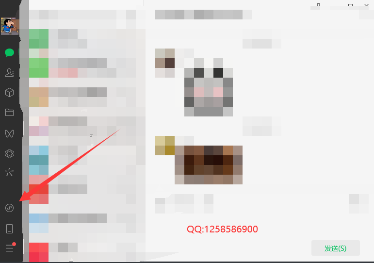
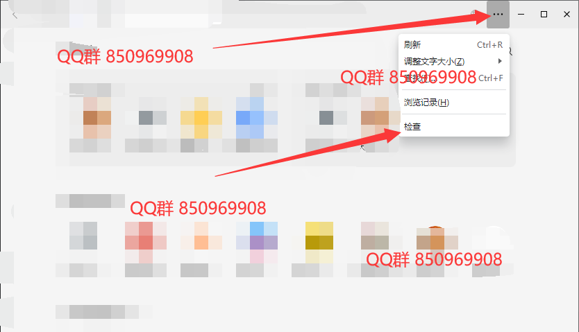
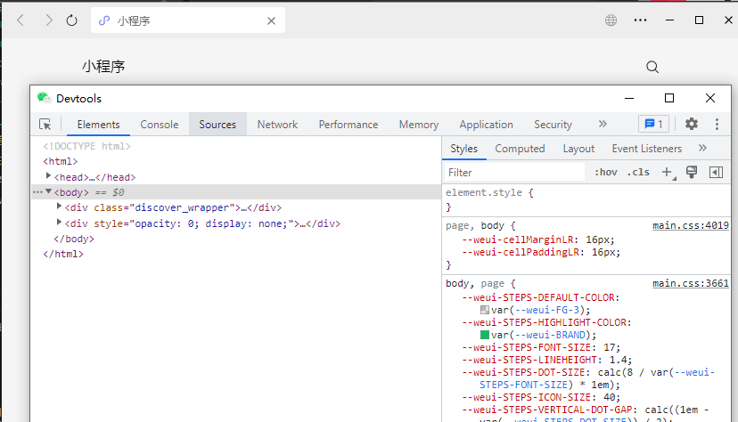
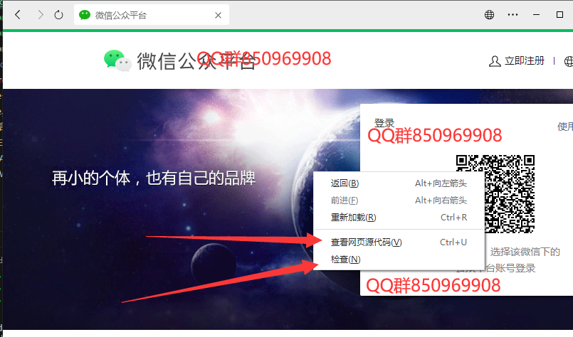
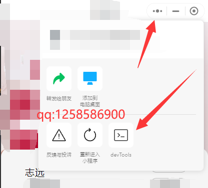

# WeChatOpenDevTools

### 介绍

这是一个专门为爬虫领域制作的库,用来快速调试PC端的微信浏览器和微信小程序.原理是利用Frida Hook微信的配置项,并使用反汇编技术修改了微信的指令集。

**注意只支持 Window 平台！！！！**

注意本库只能作为学习用途, 造成的任何问题与本库开发者无关, 如侵犯到你的权益，请联系下面的作者QQ说明来意后删除

[点击链接加入QQ群聊【编程喵交流群】](http://qm.qq.com/cgi-bin/qm/qr?_wv=1027&k=6egP5tm2rrUCPOJj0j52PCyL5MM6YuYP&authKey=89mtVgStEuC85eDLVx6bRFhlTiqgjd6NmYIaICLYDGkfLExrLxHafFBoWakKfn4N&noverify=0&group_code=850969908)                             

上面的群是一个专门玩js逆向的群！欢迎各位大佬来一起研究技术.


志远QQ:1258586900

### 支持版本

| 微信版本 WeChatWin.dll | 小程序版本  WeChatAppEx.exe | 状态   |
| ---------------------- | --------------------------- | ------ |
| 3.9.7.29_x64           | 8447_x64                    | 最新版 |
|                        |                             |        |
|                        |                             |        |


### 使用方式

1.下载Python 3.x安装并设置环境变量

2.下载Node.JS  v18.15.0安装并设置环境变量

3.进入项目目录 cmd运行 下面命令安装依赖

npm install

4.安装依赖失败的原因：
     node-gyp 自行安装 并且 自行安装 vs2019 选择C++桌面开发安装，安装后再 npm install
     或者自行百度 node-gyp
     

####  WeChatWin.dll.js 

微信浏览器打开F12需要运行 WeChatWin.dll.js  并传入参数

WeChatWin.dll.js的实现采用了静态代码补丁Pacth的方式,会自动给WeChatWin.dll打补丁

**所以不能提前运行微信！！** 

##### 使用vscode

```json
//注意提前把微信给彻底关闭 
//你可以新建一个运行配置 launch.json 然后运行
 {
      "type": "node",
      "request": "launch",
      "name": "WeChatWin.dll",
      "skipFiles": [
          "<node_internals>/**"
      ],
      "program": "${workspaceFolder}\\WeChatWin.dll.js",
    //在这里分别传入 版本号  程序位    WeChatWin.dll所在的路径
      "args": ["3.9.7.29","x64","C:/Program Files/Tencent/WeChat/[3.9.7.29]"]
}
```

##### 使用cmd命令行

```js
//注意提前把微信给彻底关闭 
//你可以使用命令行运行
//在WeChatWin.dll.js的目录运行命令行
//    代码文件         微信版本  位         "WeChatWin.dll的绝对路径"
node WeChatWin.dll.js 3.9.7.29 x64 "C:/Program Files/Tencent/WeChat/[3.9.7.29]"
```

##### 运行后回显

```powershell
//显示如下即可
PS H:\WeChatOpenDevTools> node WeChatWin.dll.js 3.9.7.29 x64 "C:/Program Files/Tencent/WeChat/[3.9.7.29]"
WeChatWin.dll已备份! c:\program files\tencent\wechat\[3.9.7.29]\WeChatWin_old.dll
完成覆盖!

//错误处理    部分用户C盘微信安装目录没有权限 设置权限即可
```

##### 运行微信查看效果







或者可以在网页中右键



#### WeChatAppEx.exe.js 

微信小程序打开F12,

WeChatAppEx.exe.js 采用Frida 热补丁Pacth的方式

**需要提前运行微信.需要提前运行微信.需要提前运行微信**

##### 使用Vscode

```json
//新建一个运行配置
 {
      "type": "node",
      "request": "launch",
      "name": "WeChatAppEx.exe",
      "skipFiles": [
           "<node_internals>/**"
      ],
      "program": "${workspaceFolder}\\WeChatAppEx.exe.js",
     //WeChatAppEx.exe版本      位
     //注意版本信息在WeChatAppEx.exe的目录中
     //比如                                                                     版本
     //C:\Users\12585\AppData\Roaming\Tencent\WeChat\XPlugin\Plugins\RadiumWMPF\8447\extracted\runtime
      "args": ["8447","x64"]
 }
```

##### 使用cmd命令行

```js
//在WeChatAppEx.exe.js所在目录运行命令行
node WeChatAppEx.exe.js 8447 x64
```

##### 运行后回显

```js
PS H:\WeChatOpenDevTools> node WeChatAppEx.exe.js 8447 x64
HOOK文件组装成功!
WeChatAppEx.exe 注入成功!

```

##### 运行小程序查看效果

```
//打开一个小程序后
HOOK到小程序加载! wxa+id
```




##### 